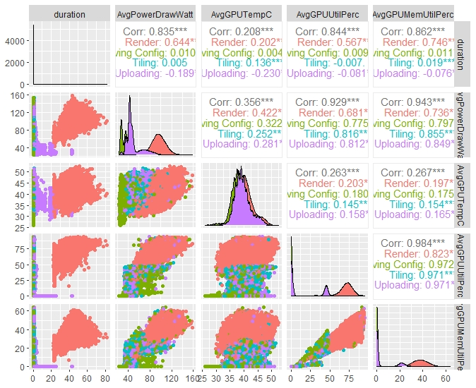

# CSC8634_TeraScopeProject_Cahyadi_200511881

Welcome to **Performance Evaluation Of Terapixel Rendering in Cloud(Super) Computing Project**!

# Abstract

 
...
 **Context** 
  
&nbsp;&nbsp;&nbsp; As the demand and implementation of cloud technologies increased, subsequently there is an increase of interest in finding information for improving its efficiency through Performance evaluation. This project would extract such performance evaluation out of cloud architecture meant to produce Terapixel image of 3D city visualisation of Newcastle Upon Tyne.  

...
 **Objective** 
  
&nbsp;&nbsp;&nbsp; The goal of this project is that performance evaluation should be able to pin point the area in which an optimisation should be focused on, and extract necessary performance information out of the current hardware and services utilised in the current cloud architecture.   

...
 **Method** 
  
&nbsp;&nbsp;&nbsp; To achieve such goal, a data mining process would be conducted following a CRISP-DM best practice method. The main program in which the data mining process is done is Rstudio and further streamlined by using the Project Template package.  

...
 **Results** 
  
&nbsp;&nbsp;&nbsp; Implementing these data mining process into the data we can extract the hardware performance information regarding on its capabilities to render an image tile. And the results of these analyses can provide answers to the questions necessary for evaluating the   performance of the current cloud-architecture  

...
 **Novelty** 
  
&nbsp;&nbsp;&nbsp; This project is done entirely using the CRISP-DM methodology and focuses on creating an EDA on the data set in which, the results of this project serve as a foundation for future projects on the cloud-architecture meant to produce terapixel 3D City visualisation of Newcastle Upon Tyne.  

 

# Project Template Description 

&nbsp;&nbsp;&nbsp; Since this project follows 
